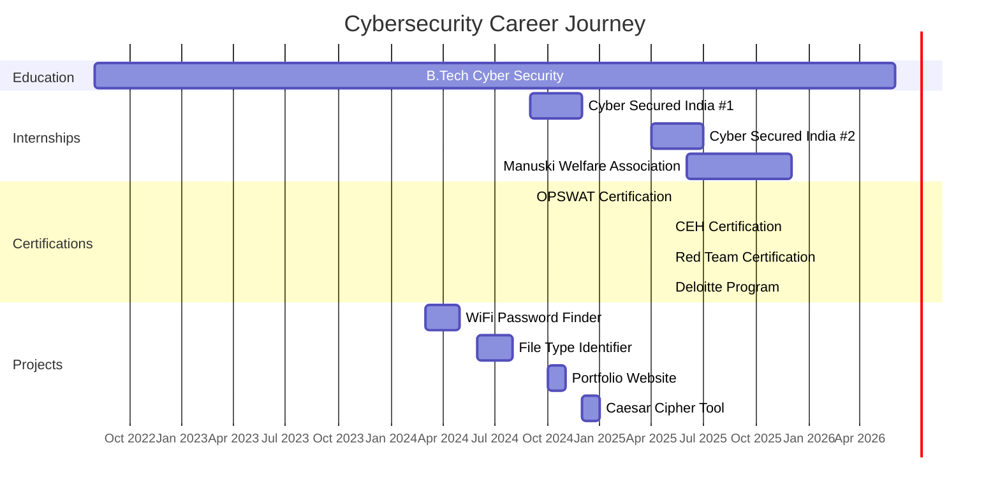

# 🔐 Cybersecurity Portfolio | Aniket Sabale

<div align="center">


### **"The quieter you become, the more you are able to hear."** - *Anonymous*

[](https://tryhackme.com/p/aniketsable2424)
[](https://www.linkedin.com/in/aniket-sabale-3ab03423a)
[](https://git.io/streak-stats)

</div>

## 👨‍💻 About Me

```python
#!/usr/bin/env python3

class CybersecurityProfessional:
    def __init__(self):
        self.name = "Aniket Sabale"
        self.title = "Cybersecurity Engineering Student"
        self.location = "Pune, Maharashtra, India"
        self.education = "B.Tech Cyber Security Engineering"
        self.specializations = [
            "Penetration Testing",
            "Digital Forensics", 
            "Vulnerability Assessment",
            "Network Security",
            "Ethical Hacking"
        ]
        
    def get_stats(self):
        return {
            "tryhackme_rank": "Top 1% globally",
            "learning_streak": "294 days continuous",
            "challenges_completed": "400+ security challenges",
            "assessments_done": "150+ vulnerability assessments",
            "internships_completed": "3 cybersecurity internships",
            "projects_developed": "15+ security tools",
            "certifications_earned": "5+ industry certifications"
        }
    
    def contact(self):
        return {
            "📧 Email": "aniketsable2424@gmail.com",
            "📱 Phone": "+91 93229 79660",
            "💼 LinkedIn": "https://linkedin.com/in/aniket-sabale-3ab03423a",
            "🐙 GitHub": "https://github.com/aniketsable",
            "🛡️ TryHackMe": "https://tryhackme.com/p/aniketsable2424",
            "📸 Instagram": "https://www.instagram.com/aniket.r00t/"
        }

# Initialize profile
me = CybersecurityProfessional()
print(f"🚀 Initializing {me.name}'s Security Profile...")
print(f"📍 Location: {me.location}")
print(f"🎓 Education: {me.education}")
print(f"⚡ Specializations: {', '.join(me.specializations[:3])}")
print("\n📊 Current Stats:")
for key, value in me.get_stats().items():
    print(f"   • {key.replace('_', ' ').title()}: {value}")
```

## 🎯 Quick Stats

<div align="center">

| **Category** | **Achievement** | **Status** | **Icon** |
|--------------|-----------------|------------|----------|
| **TryHackMe Rank** | Top 1% Globally | 🏆 **Elite** |  |
| **Learning Streak** | 294 Days | 🔥 **Active** |  |
| **Projects** | 15+ Completed | ✅ **Live** |  |
| **Certifications** | 5+ Obtained | 📜 **Verified** |  |
| **Internships** | 3 Completed | 💼 **Experienced** |  |

</div>

## 🛠️ Tech Stack & Tools

### **🛡️ Cybersecurity Arsenal**
```bash
┌─────────────────────────────────────────────────┐
│              CYBERSECURITY TOOLKIT               │
├─────────────────────────────────────────────────┤
│  ⚔️  Penetration Testing                        │
│     ├── Metasploit Framework                    │
│     ├── Burp Suite Professional                 │
│     ├── Nmap Network Scanner                    │
│     └── OWASP ZAP                               │
│                                                 │
│  🔍  Digital Forensics                          │
│     ├── Autopsy                                 │
│     ├── FTK Imager                              │
│     ├── Volatility Framework                    │
│     └── Wireshark                               │
│                                                 │
│  🛡️  Network Security                          │
│     ├── Snort IDS/IPS                           │
│     ├── PfSense Firewall                        │
│     ├── OpenVAS                                 │
│     └── Aircrack-ng                             │
└─────────────────────────────────────────────────┘
```

### **💻 Programming Languages**
<div align="center">


</div>

### **🎨 Web Development**
<div align="center">


</div>

### **🔧 Platforms & Environments**
<div align="center">


</div>

## 🏆 Certifications & Achievements

<div align="center">

| **Badge** | **Certification** | **Issuer** | **Date** |
|-----------|-------------------|------------|----------|
|  | **Certified Ethical Hacker** | LinkedIn Learning | May 2025 |
|  | **Red Team Operator Series** | LinkedIn Learning | May 2025 |
|  | **OPSWAT Cybersecurity** | OPSWAT Academy | Sept 2024 |
|  | **Deloitte Cyber Program** | Forage Virtual | May 2025 |
|  | **CompTIA Security+** | CompTIA | *In Progress* |

</div>

## 💼 Professional Timeline



## 🚀 Featured Projects

<div align="center">

### **🔐 [WiFi Password Finder](https://github.com/aniketsable/wifi-password-finder)**
*GPU-accelerated password recovery tool with 70% faster execution*
<div>
  
  
  
</div>
> 🔹 **Features:** GPU acceleration, 70% faster brute-force, optimized algorithms

### **🔍 [File Type Identification Tool](https://github.com/aniketsable/file-identifier)**
*Forensic tool for magic number-based file type detection*
<div>
  
  
  
</div>
> 🔹 **Features:** Magic number analysis, bypass extension disguises, malware detection

### **📊 [Portfolio Website](https://aniketsable.github.io)**
*Modern responsive portfolio with cybersecurity theme*
<div>
  
  
  
  
</div>
> 🔹 **Features:** Modern UI/UX, responsive design, GitHub Pages deployment

### **🔒 [Caesar Cipher Tool](https://github.com/aniketsable/caesar-cipher)**
*Cryptographic utility for encryption/decryption with brute-force*
<div>
  
  
  
</div>
> 🔹 **Features:** Configurable key shifts, automated brute-force, encryption/decryption

</div>

## 📈 GitHub Analytics

<div align="center">

<!-- GitHub Stats Cards -->
[](https://github.com/aniketsable)
[](https://github.com/aniketsable)

<!-- Activity Graph -->
[](https://github.com/aniketsable)

<!-- Trophy Stats -->
[](https://github.com/ryo-ma/github-profile-trophy)

</div>

## 🎮 TryHackMe Progress

<div align="center">


| **Metric** | **Value** | **Icon** |
|------------|-----------|----------|
| **Global Rank** | Top 1% | 🥇 |
| **Rooms Completed** | 85+ | 📚 |
| **Days Streak** | 294 | 🔥 |
| **Learning Paths** | 12+ | 🛣️ |
| **Challenge Machines** | 50+ | 🖥️ |
| **Total Points** | 20,000+ | ⭐ |

</div>

## 📊 Detailed Stats

<div align="center">

<!-- Profile View Counter -->


<!-- Followers Counter -->
[](https://github.com/aniketsable?tab=followers)

<!-- Repository Stats -->


</div>

## 📫 Connect With Me

<div align="center">

[](https://linkedin.com/in/aniket-sabale-3ab03423a)
[](https://github.com/aniketsable)
[](https://tryhackme.com/p/aniketsable2424)
[](https://www.instagram.com/aniket.r00t/)
[](mailto:aniketsable2424@gmail.com)
[](https://aniketsable.github.io)

</div>

## 🌟 Daily Cybersecurity Quote

<div align="center">

> "In cybersecurity, the best defense is a good offense. Know your enemy's tactics better than they know yours."
> 
> *– Aniket Sabale*

### 🔥 **Current Focus**


</div>

---

## 🎨 Profile Customization

```bash
# Terminal Commands for Security Setup
$ sudo apt-get install security-tools
$ git clone https://github.com/aniketsable/security-scripts.git
$ cd security-scripts && chmod +x setup.sh
$ ./setup.sh --ethical-hacker-mode
```

## 🤝 Contributing & Collaboration

<div align="center">

[](https://buymeacoffee.com/aniketsable)
[](https://github.com/sponsors/aniketsable)

**I'm always open to collaborating on cybersecurity projects. Feel free to:**
- 🐛 Open an issue for bugs or feature requests
- 🔄 Submit a pull request with improvements
- 💬 Reach out for security consultation
- 🎯 Join me on TryHackMe rooms

</div>

---

## 📋 How to Reach Me

<table align="center">
  <tr>
    <td align="center" width="50%">
      <strong>📧 Quick Contact</strong><br><br>
      • Email: aniketsable2424@gmail.com<br>
      • Phone: +91 93229 79660<br>
      • LinkedIn: aniket-sabale-3ab03423a<br>
      • GitHub: @aniketsable
    </td>
    <td align="center" width="50%">
      <strong>🎯 Project Preferences</strong><br><br>
      • Cybersecurity tools<br>
      • Penetration testing scripts<br>
      • Security automation<br>
      • Open-source security projects
    </td>
  </tr>
</table>

---

<div align="center">

### **💻 `echo "Security is not a product, but a process."`**

**Made with ❤️ and 🛡️ by Aniket Sabale**


⭐ **Star my repositories if you find them useful!**  
🔔 **Follow for more cybersecurity content and projects.**

</div>

---

### ⚠️ Disclaimer
*All tools and projects shared here are for **educational purposes only**. Use only on systems you own or have explicit permission to test.*

---

<details>
<summary>📊 Additional Statistics (Click to expand)</summary>

<!-- More detailed stats -->


</details>

<details>
<summary>🎵 Currently Listening</summary>


</details>

---

<div align="center">

**Last Updated: $(date +"%Y-%m-%d %H:%M:%S")**  
**Profile Visitors: **

**Keep Calm and Hack Ethically 🚀**

</div>
