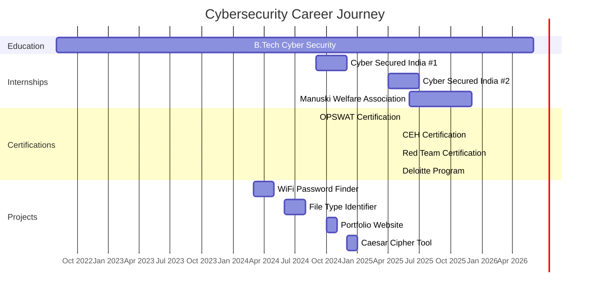

<p align="center">
<a href="https://git.io/typing-svg"></a>
</p>

<p align="center">
  
  
  
</p>

<div align="center">
  <!-- Interactive Hero Element -->
  
  <p align="center">
    <i>"Security is not a product, but a process. Finding vulnerabilities before the bad guys do."</i>
  </p>
</div>

---

### 🛠️ Strategic Tech Arsenal

<p align="center">
  
</p>

<p align="center">
  
  
  
  
</p>

<!-- Moving Hackerman Text -->
<div class="hackerman-text">
  <marquee behavior="scroll" direction="left" scrollamount="5">
    🔐 ACCESS GRANTED • ROOT PRIVILEGES ENABLED • SYSTEM SECURED • PENETRATION TESTING • VULNERABILITY ASSESSMENT •
  </marquee>
</div>


## 💼 Professional Timeline




## 🚀 Featured Projects

<div align="center">

### **🔐 [WiFi Password Finder](https://github.com/aniketsable/wifi-password-finder)**
*GPU-accelerated password recovery tool with 70% faster execution*
<div>
  
  
  
</div>
> 🔹 **Features:** GPU acceleration, 70% faster brute-force, optimized algorithms

### **🔍 [File Type Identification Tool](https://github.com/aniketsable/file-identifier)**
*Forensic tool for magic number-based file type detection*
<div>
  
  
  
</div>
> 🔹 **Features:** Magic number analysis, bypass extension disguises, malware detection

### **📊 [Portfolio Website](https://aniketsable.github.io)**
*Modern responsive portfolio with cybersecurity theme*
<div>
  
  
  
  
</div>
> 🔹 **Features:** Modern UI/UX, responsive design, GitHub Pages deployment

### **🔒 [Caesar Cipher Tool](https://github.com/aniketsable/caesar-cipher)**
*Cryptographic utility for encryption/decryption with brute-force*
<div>
  
  
  
</div>
> 🔹 **Features:** Configurable key shifts, automated brute-force, encryption/decryption

</div>

### 📫 Establish Connection

<p align="center">
  <a href="https://linkedin.com/in/aniket-sabale-3ab03423a" target="_blank">
    
  </a>
  <a href="https://github.com/aniketsable" target="_blank">
    
  </a>
  <a href="https://tryhackme.com/p/aniketsable2424" target="_blank">
    
  </a>
  <a href="https://www.instagram.com/aniket.r00t/" target="_blank">
    
  </a>
</p>

<details>
<summary><b>📌 ACCESS SYSTEM LOGS (Quick Info)</b></summary>
  
<!-- Animated Binary Rain Background -->
<div class="binary-rain"></div>

```yaml
identity: Aniket Sabale
origin: Pune, India
intel: B.Tech Cyber Security Engineering
availability: Active (Internships/Roles)
operations:
  - Penetration Testing
  - Digital Forensics
  - Vulnerability Assessment
roadmap: OSCP Certification
terminal_contact: aniketsable2424@gmail.com
```
</details>

<p align="center">
  
</p>

💻 echo "Security is not a product, but a process."
Made with ❤️ and 🛡️ by Aniket Sabale
